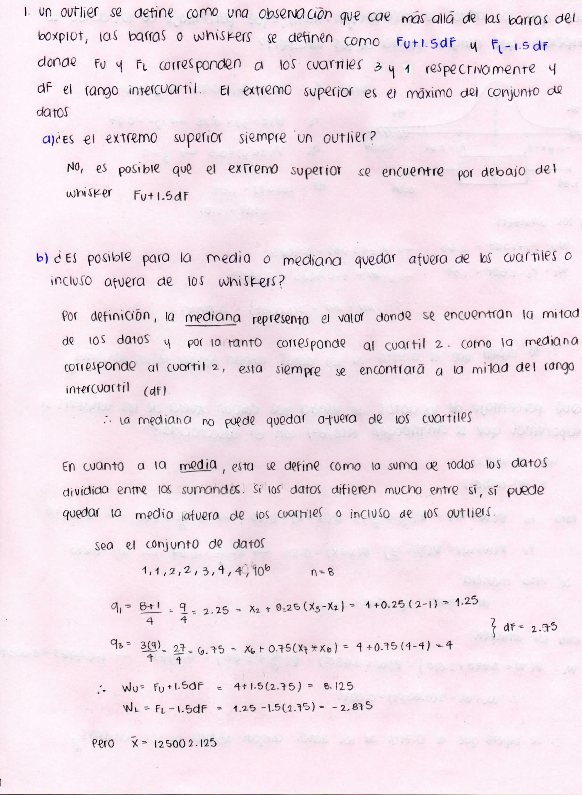
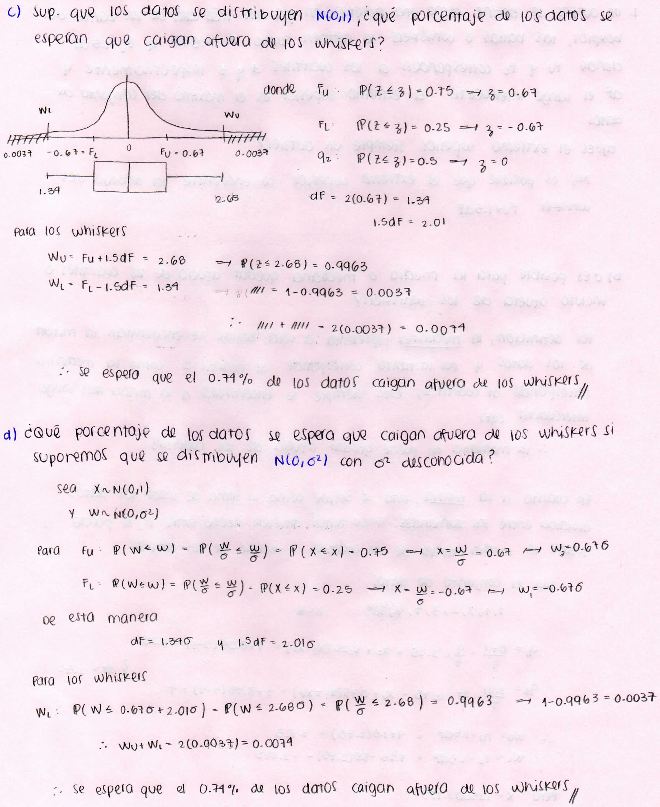
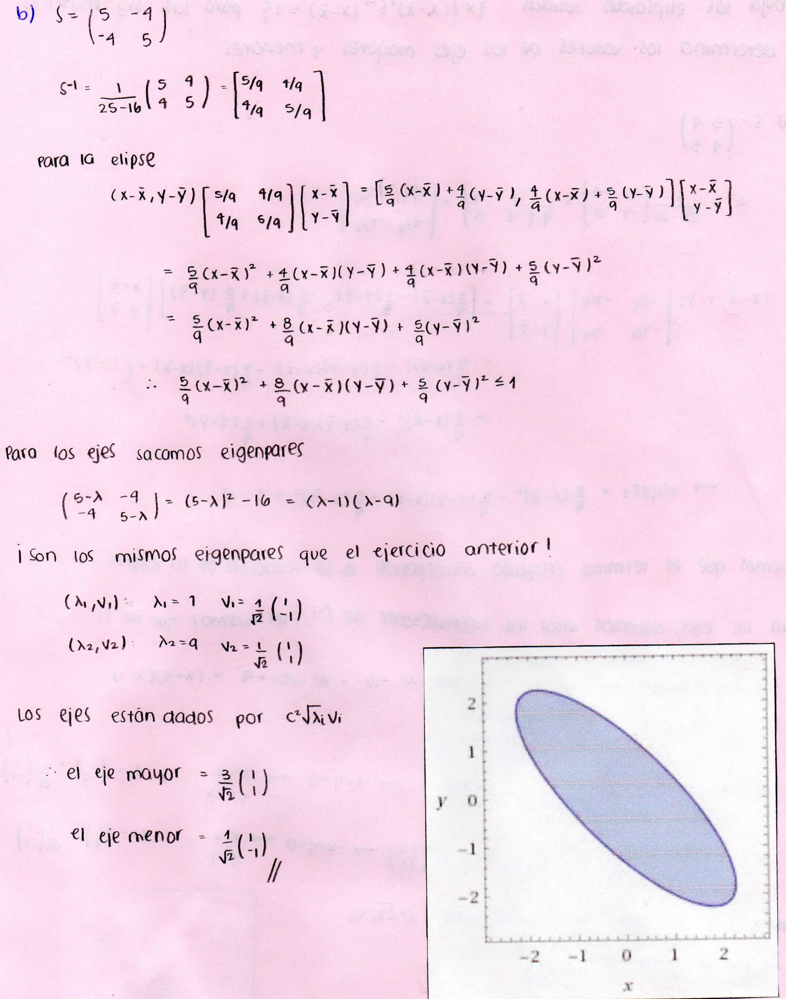
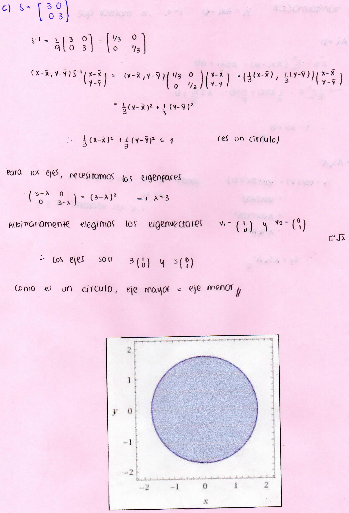
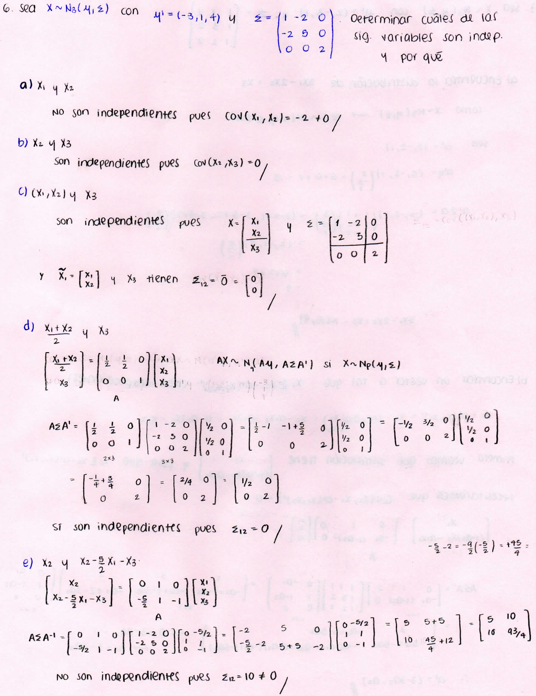
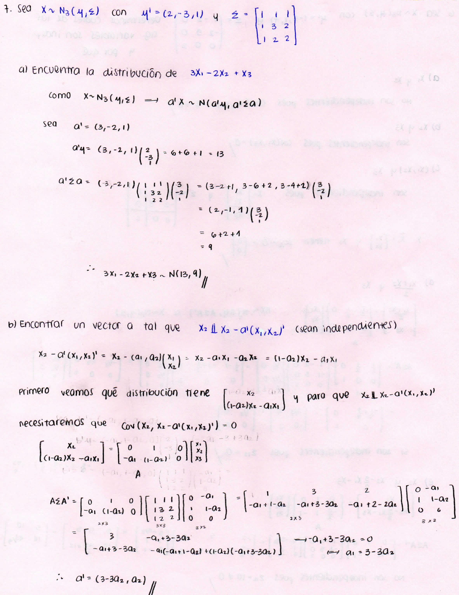
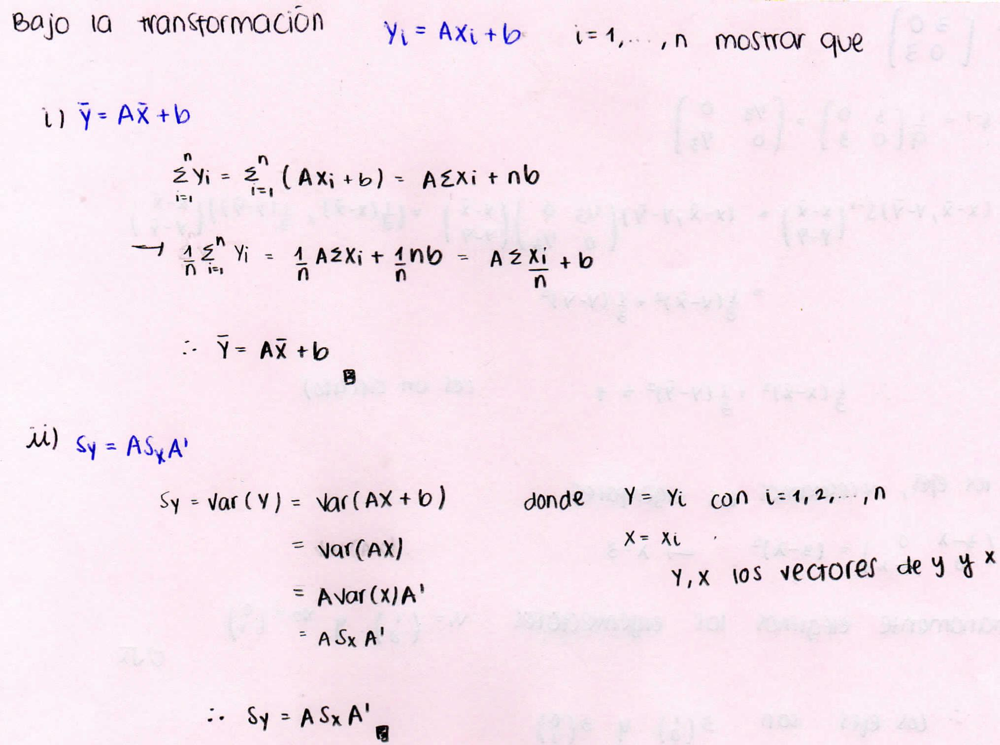
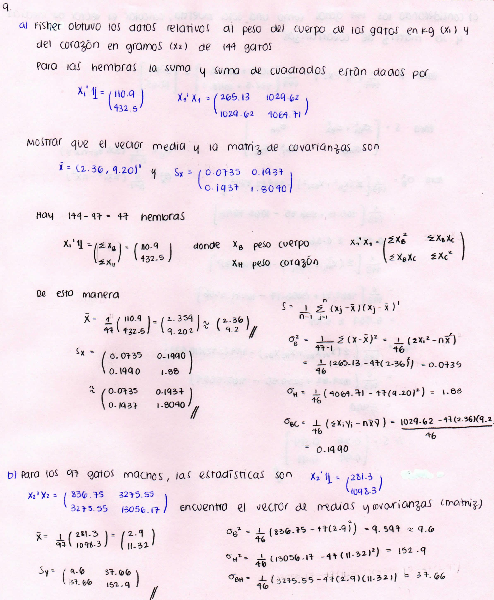
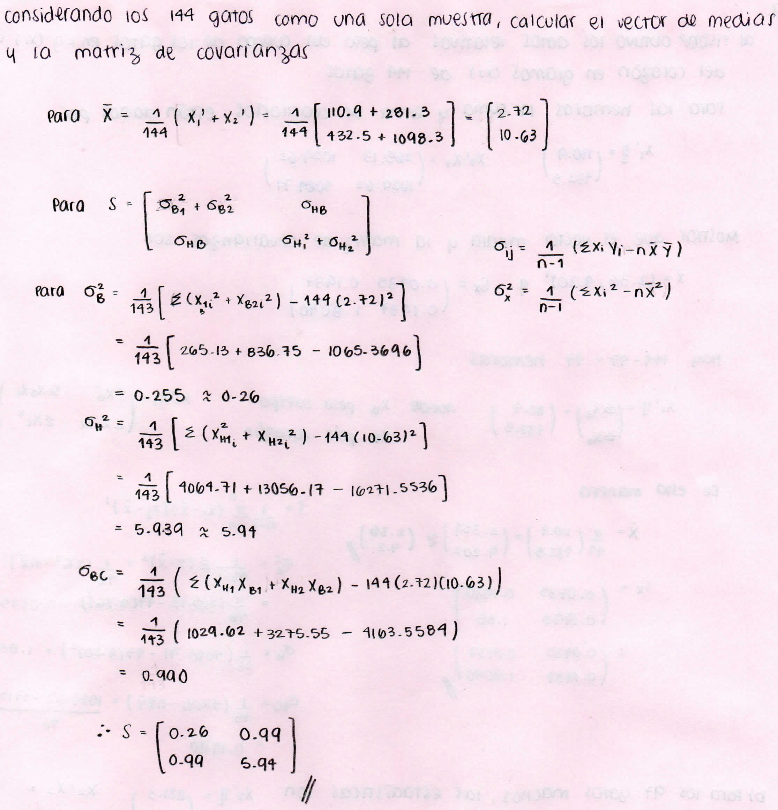
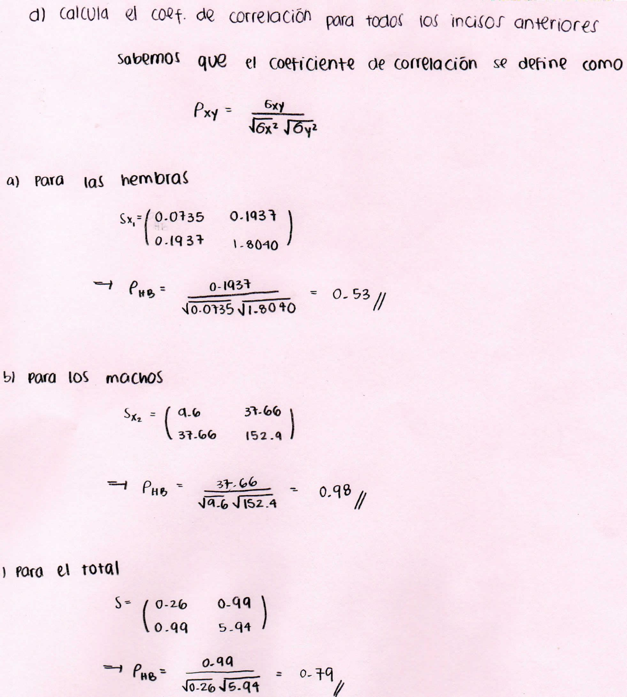

```{r, message=FALSE, warning=FALSE, echo = FALSE}
library(lattice)
library(knitr)
library(ggplot2)
# library(nutshell)
library(tidyverse)
library(aplpack)
```

### **Pregunta 1**






**2. 50 observaciones de una $\mathcal{N}(0,1)$ y otras 50 observaciones de una $\mathcal{N}(2,1)$. ¿Cómo se verán las 100 caras de Chernoff si $_X_$ y $_Y_$ definen la línea de la cara y la oscuridad del cabello?, ¿esperan caras similares?, ¿cuántas caras lucen como oservaciones de $_Y_$ cuando aún son observaciones de $_X_$?**
```{r}
  ind      = matrix(0, ncol = 36)   # define una indicadora para el argumento which.row
  ind[,13] = 1                      # linea derecha de la cara
  ind[,14] = 1                      # oscuridad del cabello lado derecho
  ind[,31] = 1                      # linea izquierda de la cara
  ind[,32] = 1                      # oscuridad izquierda del cabello
  x      = rnorm(50)               
  y      = rnorm(50, mean = 2) 
  z      = t(cbind(t(x),t(y)));    # arma matriz (100x1)
  faces(as.matrix(z[1:50]),ind, main="Observaciones 1 a 50", ncol.plot = 5, nrow.plot = 10) # primeras 50 caras
  faces(as.matrix(z[51:100]),ind, main="Observaciones 51 a 100", ncol.plot = 5, nrow.plot = 10) # primeras 50 caras
  x
  y
```

Sí hubo caras similares. Hay 4 payasos en Y comparado con los 3 que hay de X. Hay casi la misma cantidad de caras rojas y cabello verde; hay 4 caras amarillas en Y comparadas con las 10 que hay en X.
Las caras rojas son aquellos valores cercanos a 0, mientras que los payasos son los valores más grandes (+/- 3)


**3. Consideren los siguientes datos**

**a. Encuentra la proyección de $X_1$ sobre 1'=(1,1,1,1,1,1)**
```{r}
  # x1 = Nómina de jugadores
  x1 <- c(3497900,2485475,1782875,1725450,1645575,1469800)

  # Defino al vector de 1 normalizado 
  ones <- rep(1,6)/sqrt(6)
  
  # Definición de proyección de x1 sobre 1
  proy = t(x1) %*% ones %*% ones
  proy
  
```

**b. Calcula el vector desviación. Relaciona su longitud a la desviación estándar.**
```{r}
  # Definición de vector desviación
  vDesv <- x1 - proy
  vDesv
  
  # Desviación estándar
  StanDev <- sd(x1)
  StanDev
```

Notemos que el cuadrado de la longitud del vector desviación es igual a *$n\times d^2$* donde *d* es la desviación estándar
```{r}

  # Longitud del vector
  norma <- norm(vDesv)
  norma^2
  
  6*(StanDev^2)
  
```

**c. Grafica (a escala) el triángulo formado por $y_1$, $\bar{x}_1$, $y_1-\bar{x}_1$. Identifica la longitud de cada vector en tu gráfica**
```{r}
  plot.new()
  points(x1, proy, vDesv)
```

**d. Repetir los incisos (a) a (c) para $X_2$**
*a'. Encuentra la proyección de $X_2$ sobre 1'=(1,1,1,1,1,1)*
```{r}

  # x2 = % de perdidos-ganados
  x2 <- c(0.623,0.593,0.512,0.5,0.463,0.395)
  
  # Definición de proyección de x2 sobre 1
  proy2 = t(x2) %*% ones %*% ones
  proy2
  
```

*b'. Calcula el vector de desviación*
```{r}

  # Definición de vector desviación
  vDesv2 <- x2 - proy2
  vDesv2
  
  # Desviación estándar
  StanDev2 <- sd(x2)
  StanDev2

```

*c'. Grafica (a escala) el triángulo formado por $y_2$, $\bar{x}_2$, $y_2-\bar{x}_2$. Identifica la longitud de cada vector en tu gráfica*
```{r}

```

**e. Grafica (a escala) los dos vectores desviación $y_1-\bar{x}_1$ y $y_2-\bar{x}_2$. Calcula el valor del ángulo entre ellos**
```{r}

```

**f. Calcula la varianza muestral generalizada (vmg) det(S) para estos datos e interpreta**
```{r}
  X <- cbind(x1,x2)                 # Creo la matriz de X1 y X2
  n <- nrow(X)
  uno <- rep(1,n)
  xBar <- t(X) %*% uno / n          # x barra
  H <- diag(n) - uno%*%t(uno) / n   # H
  Sn <- t(X) %*% H %*% X / n        # Sn
  S <- n/(n-1) * Sn
  
  vmg <- det(S)
  vmg
```
Como la vmg es proporcional al cuadrado del olumen generado por los p vectores de desviación. COmo vmg = 844182191, entonces sabemos que el volumen del elipsoide al cuadrado generado por $S$, será igual al vmg multiplicado por una constante proveniente de la ecuación del elipsoide correspondiente a $S$.

**g. Calcula la varianza muestral total (vmt) tr(S) para estos datos e interpreta**
```{r}
vmt <- sum(diag(S))
vmt
```
Geométricamente, la vmt es la suma de las longitudes al cuadrado de los p vectores de desviación divididos entre n-1; sin embargo, no le presta atención a la orientación de los vectores residuales.
Como vmt = 589443426354, entonces sabemos que estas corresponde a la suma de las varrianzas de los p elementos de la matriz.


**4. Dibuja las elipsoides sólidas para las tres matrices siguientes y determina los valores de los ejes mayores y menores**







**5. Archivo del INEGI**

**a. Configura la matriz X para poder operar con ella**
```{r}
# datos <- read.csv("D:\\ITAM\\Aplicada III\\Tareas\\HW2\\INEGIConstruccion2017.csv", header=FALSE)
datos <- read.csv(".\\INEGIConstruccion2017.csv", header=FALSE)
datos <- datos[-1,]

names(datos) <- as.matrix(datos[1,])    # Tomo primer renglón
datos <- datos[-1,]                     # Elimino el primer renglón
datos[] <- lapply(datos, function(x) type.convert(as.character(x))) # Primera columna names(datos) se vuelve el header

# Datos de enero 2017
datos <- datos %>% filter(Periodo == "2017/01")
head(datos)

datosTotalesNac <- datos[,str_detect(names(datos), "Total nacional")]
# Horas trabajadas (dependiente + no dependiente, o lo mismo que es la suma de los totales por estado)
hrasTrabajadas <- datosTotalesNac %>% select(2,6) #dependiente y no dependiente

# x1: total de horas trabajadas
sumaHorasT <- hrasTrabajadas[,1]+hrasTrabajadas[,2]

#x2: valor total de producción
totalProd <- datos[,str_detect(names(datos), "tipo de obra > Total Total")]

#x3: total de horas trabajadas Dependiente
horasDep <- hrasTrabajadas[,1]

#x4: Obreros Dependiente
obrerosDep <- datosTotalesNac[,str_detect(names(datosTotalesNac), "Obreros")]

#x5: Empleados Dependiente
empDep <- datosTotalesNac[,str_detect(names(datosTotalesNac), "Empleados")]

#x6: Propietarios Dependiente
propDep <- datosTotalesNac[,str_detect(names(datosTotalesNac), "Propietarios")]

#x7: total de horas trabajadas No dependiente
horasNoDep <- hrasTrabajadas[,2]

(X <- c(sumaHorasT, totalProd, horasDep, obrerosDep, empDep, propDep, horasNoDep))
```

**b. Calcula el vector de medias y la matriz de covarianzas de la matrix X**
```{r}

#Si consideramos la X como descrita arriba, el vector de medias es el mismo que el vector X

```
### **Pregunta 6**


### **Pregunta 7**



### **Pregunta 8**



### **Pregunta 9**



